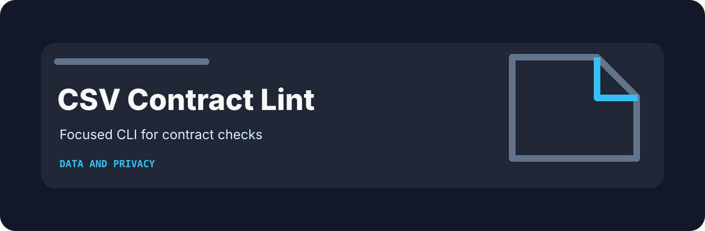
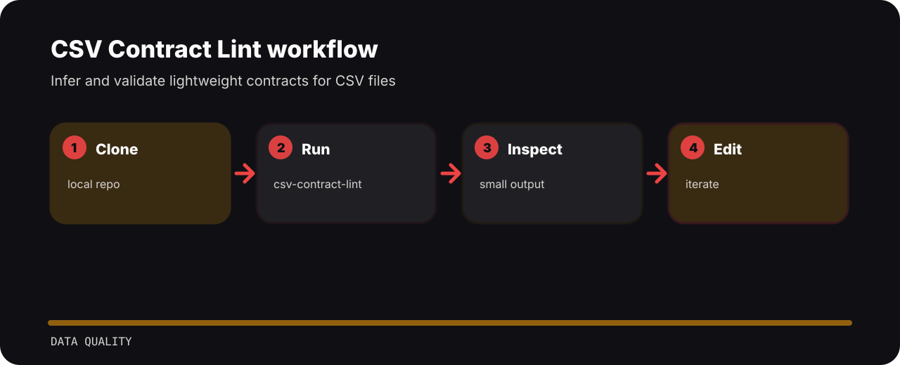

# CSV Contract Lint

Infer and validate lightweight contracts for CSV files. The repo is kept small on purpose: clone it, run the sample, inspect the output, then adapt the idea.



## Visual route



## First run

```bash
git clone https://github.com/mertefekurt/csv-contract-lint.git
cd csv-contract-lint
python -m pip install -e ".[dev]"
csv-contract-lint --help
```

## File map

```text
src/            package source
tests/          test coverage
.gitignore      project file
pyproject.toml  package metadata
```
