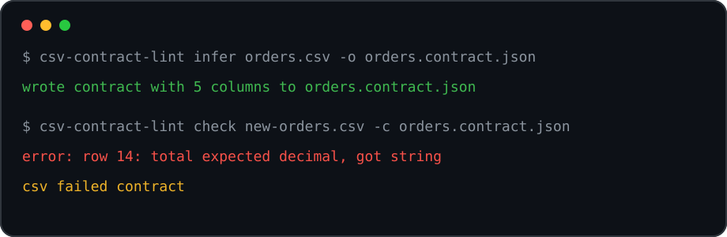

# csv-contract-lint

**Catch broken CSV handoffs before they reach imports, dashboards, or batch jobs.**

`csv-contract-lint` is a small Python CLI that learns a contract from a known-good CSV file and checks future files against it. It is useful when CSV is the boundary between teams, vendors, scheduled exports, or lightweight data pipelines.



## What it does

- infers a JSON contract from a trusted CSV sample
- checks missing columns, extra columns, required values, and scalar types
- detects controlled vocabulary drift for small status-like columns
- warns when null rates move sharply from the baseline
- works with plain files, so contracts can live in git and run in CI

## Install

```bash
python -m pip install .
```

## Quick start

Create a contract:

```bash
csv-contract-lint infer data/orders.csv -o contracts/orders.contract.json
```

Validate a new CSV:

```bash
csv-contract-lint check incoming/orders.csv -c contracts/orders.contract.json
```

Inspect the contract:

```bash
csv-contract-lint inspect contracts/orders.contract.json
```

## Example contract

```json
{
  "version": 1,
  "source": "orders.csv",
  "row_count": 2000,
  "columns": [
    {
      "name": "status",
      "type": "string",
      "nullable": false,
      "null_rate": 0,
      "unique_ratio": 0.003,
      "allowed_values": ["failed", "paid", "refunded"]
    }
  ]
}
```

## Checks

| Check | Why it matters |
| --- | --- |
| Column contract | catches renamed or missing fields |
| Type contract | catches dates, amounts, and ids turning into free text |
| Required fields | blocks empty values where the baseline had complete data |
| Allowed values | catches new enum-like states such as `pending_review` |
| Null drift | warns when a feed starts losing data silently |

## Project layout

```text
src/csv_contract_lint/
  cli.py          # command line interface
  contract.py     # contract inference
  validator.py    # csv validation rules
  types.py        # parsing and compatibility helpers
tests/            # focused behavior tests
```

## Test

```bash
python -m pytest
```

## Roadmap

- strict column ordering mode
- junit output for CI systems
- numeric min/max rules for amount-like fields
- contract diff command for reviewing baseline changes

## License

MIT
