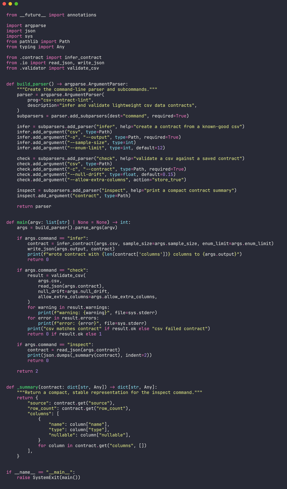
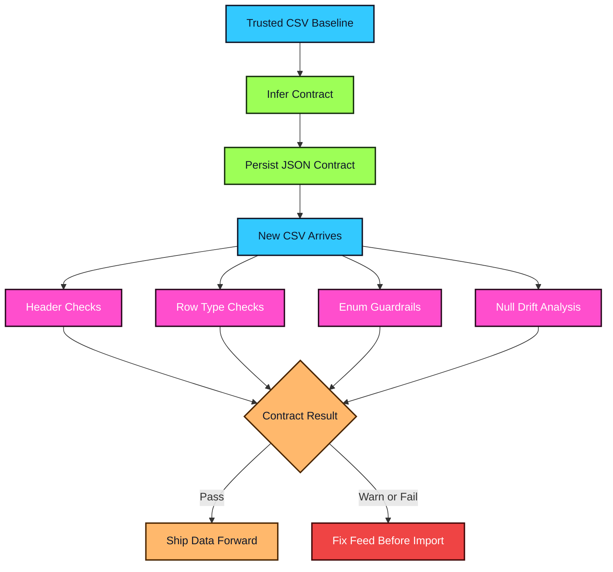

<div align="center">


</div>


`csv-contract-lint` turns a known-good CSV into a compact JSON contract and validates every future file against it. It is built for teams that still rely on CSV boundaries but need CI-friendly protection against renamed columns, silent null spikes, unexpected value sets, and type drift.

<table>
  <tr>
    <td width="50%" valign="top">


- 🧬 Infers a contract from a trusted baseline CSV
- 🧱 Detects missing columns, extra columns, and required-field breaks
- 🔎 Validates scalar types such as numbers, booleans, dates, and strings
- 🏷️ Locks small enum-like columns to observed values
- 📉 Warns when null rates drift beyond the configured threshold
- ⚙️ Ships as a clean Python CLI with focused pytest coverage

  </td>
  <td width="50%" valign="top">



  </td>
  </tr>
</table>





```bash
git clone https://github.com/mertefekurt/csv-contract-lint.git
cd csv-contract-lint
python -m pip install .
csv-contract-lint infer data/orders.csv -o contracts/orders.contract.json
csv-contract-lint check incoming/orders.csv -c contracts/orders.contract.json
```

<details>
<summary>🛠️ View CLI Reference / Advanced Config</summary>

| Command | Purpose |
| --- | --- |
| `csv-contract-lint infer <csv> -o <contract>` | Create a contract from a known-good CSV file |
| `csv-contract-lint check <csv> -c <contract>` | Validate a CSV against a saved contract |
| `csv-contract-lint inspect <contract>` | Print a compact contract summary |

| Option | Command | Default | Purpose |
| --- | --- | --- | --- |
| `--sample-size` | `infer` | all rows | Limit the baseline rows used for inference |
| `--enum-limit` | `infer` | `12` | Capture allowed values for low-cardinality columns |
| `--null-drift` | `check` | `0.15` | Warn when observed null rate exceeds baseline by this amount |
| `--allow-extra-columns` | `check` | disabled | Ignore additional columns in incoming files |

| Check | Signal |
| --- | --- |
| Missing columns | A required field disappeared from the incoming CSV |
| Extra columns | A new field arrived without a contract update |
| Type compatibility | A column changed from its inferred scalar type |
| Required values | A non-null baseline column now contains empty cells |
| Allowed values | A controlled vocabulary gained an unexpected value |
| Null drift | A field is losing data at a materially higher rate |

</details>


```text
csv-contract-lint/
├── src/csv_contract_lint/
│   ├── cli.py          # argparse commands and exit behavior
│   ├── contract.py     # baseline inference and contract shape
│   ├── validator.py    # validation errors, warnings, and drift checks
│   ├── types.py        # scalar parsing and compatibility rules
│   └── io.py           # JSON persistence helpers
├── tests/              # contract and validator coverage
└── assets/
    └── code-snapshot.png
```


MIT
